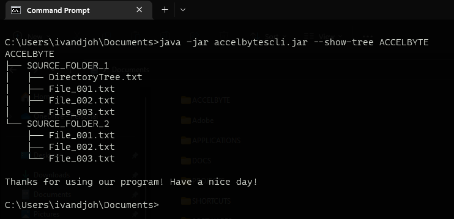

# AccelByte-CLI

### About AccelByte CLI

`AccelByte CLI` is a Simple Command Line Interface created by job applicants when participating in the recruitment
process as Java Sr. Software Engineer provided by the AccelByte Platform.

This simple tool that can be used to :

- view help for each command
- view folders and files in a namespace (Tree-view mode)
- copy files from/to a namespace

### AccelByte CLI jar file

This Application will be produce a `Jar Execute file` so you can run it through Command Prompt or cmd and To run
AccelByte CLI, what you have to does are:

- Read the documentation carefully and follow the steps
- Make sure you have minimum java 11 or above installed on your machine
- Find the AccelByte CLI jar file in the production folder

### Running AccelByte CLI

There are several Command that you can use when you run `AccelByte CLI` and here they are :

- **View Source Directory (current position)**
  to view the source directory, you can use the command below :
``
**java -jar AccelByte-cli.jar --show-tree <write_whatever_folder_name_here>**
``

here is the example if you are in the source folder

```
java -jar accelbyte-cli.jar --show-tree SOURCE_FOLDER_1

```

or if you are in the parent directory of the source folder, you can use the command below :

```
java -jar accelbyte-cli.jar --show-tree .\SOURCE_PARENT_FOLDER\SOURCE_FOLDER_1

```


- **View both Source Directory & Destination Directory (Preview from parent directory in Tree Mode)**
  to view both source directory and destination directory, you can use the command below :

``
**java -jar AccelByte-cli.jar --show-tree <pointing_to_parent_directory>**
``


```
java -jar accelbyte-cli.jar --show-tree SOURCE_PARENT_DIRECTORY
```




- **Run the sync command**

  to run the sync command, you can use the command below :
  **java -jar AccelByte-cli.jar sync -s <source_folder_name> -d <destination_folder_name>**
  here is the example :

```
java -jar accelbyte-cli.jar sync -s SOURCE_FOLDER_1 -d DESTINATION_FOLDER_2
```

or if you are in the parent directory of the source folder, you can use the command below :

```
java -jar accelbyte-cli.jar sync -s .\SOURCE_PARENT_FOLDER\SOURCE_FOLDER_1 -d .\DESTINATION_PARENT_FOLDER\DESTINATION_FOLDER_2

```


By [ivandjoh](https://linkedin.com/in/ivandjoh)